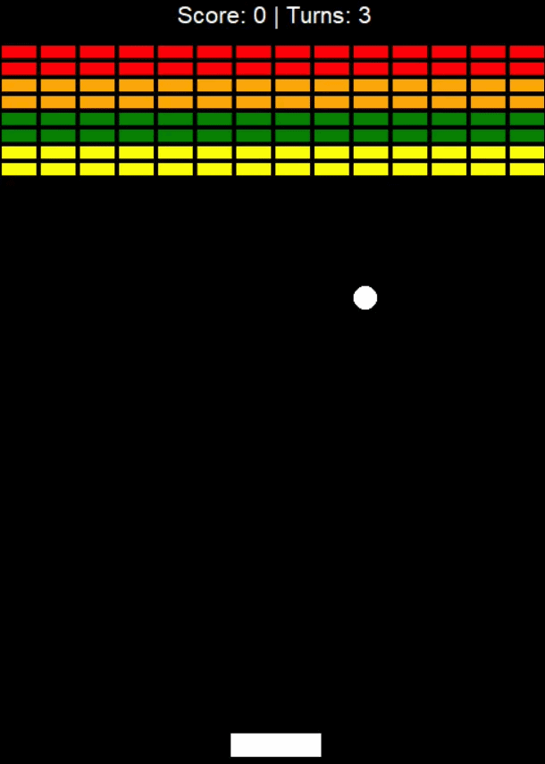

# Breakout Game

**A simple Python implementation of the classic Breakout game.**



## Project Structure
- `main.py` – Runs the game loop.
- `bricks.py` – Creates and manages the bricks.
- `paddle.py` – Creates and manages the paddle.
- `ball.py` – Creates and manages the ball.
- `score_board.py` – Tracks the score and remaining turns.

## Features
- Displays the current score and remaining turns.
- The player has three turns to clear two levels of bricks.
- Yellow bricks are worth 1 point, green bricks 3 points, orange bricks 5 points, and red bricks 7 points.
- The paddle shrinks to half its original size after the ball hits the top wall.
- The ball speeds up after 4 hits, after 12 hits, and when it first reaches the orange and red brick rows.
- Displays a victory message after clearing both levels while the ball continues bouncing.
- Displays a game over message when all turns are lost.

## Technologies
- Python 3
- Turtle Graphics
- `time` module
- `random` module

## Concepts Practiced
- Object-Oriented Programming (OOP)
- Game loop implementation
- Collision detection
- Managing game state

## How to Run
```bash
python main.py
```